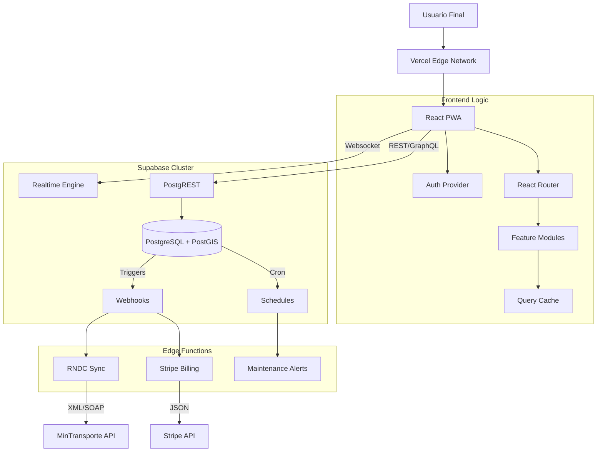

# Arquitectura del Sistema CELLVI 2.0

## 1. Visión General
CELLVI 2.0 es una plataforma SaaS diseñada para la gestión logística integral, operando bajo un modelo "Cloud-Native" y "Offline-First". Su arquitectura desacoplada garantiza escalabilidad, resiliencia y una experiencia de usuario fluida incluso en condiciones de baja conectividad.

## 2. Stack Tecnológico

### Frontend (Client-Side)
*   **Framework:** React 18 con TypeScript y Vite (Build Tool).
*   **Gestión de Estado:**
    *   *Server State:* TanStack Query (React Query) v5 para caché y sincronización.
    *   *Client State:* Zustand para estado UI ligero.
*   **Estilizado:** Tailwind CSS + Shadcn/UI (Radix Primitives) para accesibilidad y diseño "Enterprise".
*   **PWA:** Service Workers personalizados (`vite-plugin-pwa`) para caché estratégica de módulos críticos (`/preoperacional`).

### Backend (Serverless)
*   **Core:** Supabase (BaaS sobre AWS).
*   **Base de Datos:** PostgreSQL 15 con extensiones:
    *   `postgis`: Para geolocalización avanzada (Geofencing, Rutas).
    *   `pg_cron`: Para tareas programadas (Mantenimiento preventivo).
*   **Seguridad:** Row Level Security (RLS) estricto por `tenant_id`.
*   **Edge Functions:** TypeScript (Deno) para lógica de negocio compleja (Integración RNDC, Webhooks Stripe).

## 3. Diagrama de Módulos (Bounded Contexts)

## 4. Patrones de Diseño Clave

### Aislamiento Multi-Tenant
Cada consulta a la base de datos es interceptada por políticas RLS.
*   **Patrón:** `auth.uid() -> users.tenant_id -> data.tenant_id`.
*   **Garantía:** Es matemáticamente imposible que un usuario A vea datos del usuario B si la política RLS está activa.

### UX Optimista
La interfaz se actualiza instantáneamente antes de confirmar con el servidor (`useMutation` con `onMutate`).
*   **Beneficio:** Sensación de "latencia cero".
*   **Rollback:** Si la operación falla, la UI se revierte automáticamente.

### Geo-Inteligencia
El motor de tracking no solo guarda coordenadas; procesa eventos espaciales.
*   **Ingesta:** Telemetría cruda entra a `vehicle_telemetry`.
*   **Procesamiento:** Triggers PostGIS evalúan `ST_Contains(geofence.geom, point)`.
*   **Alerta:** Si hay violación, se inserta una alerta en tiempo real.

## 5. Estrategia de Despliegue (CI/CD)

1.  **Commit:** Developer hace push a `main`.
2.  **Lint/Test:** GitHub Actions (o script local pre-push) valida TypeScript y Tests.
3.  **Build:** Vercel construye la versión de producción optimizada.
4.  **Database:** Supabase aplica migraciones pendientes (`supabase db push`) de forma idempotente.

---
**Documento Generado por:** Antigravity AI Agent
**Fecha:** 13 Febrero 2026
