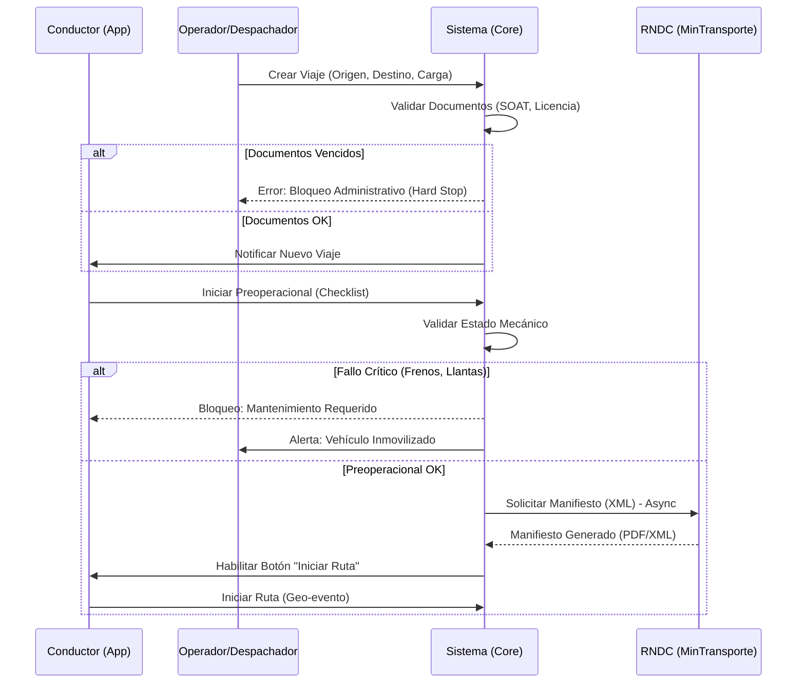

# Flujos Detallados y Contratos API — CELLVI 2.0
**Documento Técnico de Referencia** | **Versión:** 1.0

Este documento expande la sección técnica del Plan Maestro, detallando los flujos críticos y las especificaciones de interfaz.

---

## 1. Flujo Integrado: Salida a Operación (RNDC + Preoperacional)

Este flujo garantiza que ningún vehículo salga sin cumplir los requisitos legales y de seguridad.



---

## 2. Flujo de Mantenimiento Preventivo

```mermaid
graph TD
    A[Lectura Odómetro GPS] -->|Cada 100km| B{¿Supera Umbral?}
    B -->|No| A
    B -->|Si| C[Crear Alerta 'Mantenimiento Próximo']
    C --> D[Jefe de Taller aprueba]
    D --> E[Generar Orden de Trabajo (OT)]
    E --> F[Mecánico Ejecuta & Cierra]
    F --> G[Sistema Reinicia Contador]
    G --> H[Hoja de Vida Actualizada]
```

---

## 3. Especificación de APIs y Payloads

### A. Módulo Operaciones (`/ops`)

#### 1. Crear Viaje (Despacho)
`POST /api/v1/{tenant}/ops/trips`

**Payload:**
```json
{
  "vehicle_id": "uuid-1234",
  "driver_id": "uuid-5678",
  "route": {
    "origin": { "lat": 4.6, "lng": -74.0, "address": "Bogotá, Calle 80" },
    "destination": { "lat": 6.2, "lng": -75.5, "address": "Medellín, Centro" },
    "waypoints": []
  },
  "cargo": {
    "type": "General",
    "weight_kg": 5000,
    "description": "Cajas de Zapatos"
  },
  "client_reference": "REMESA-9988"
}
```

**Respuesta (201 Created):**
```json
{
  "id": "trip-uuid-9999",
  "status": "scheduled",
  "checklist_url": "/api/v1/.../preOp/trip-uuid-9999",
  "rndc_status": "pending"
}
```

#### 2. Registrar Evento de Viaje (Bitácora)
`POST /api/v1/{tenant}/ops/trips/{id}/events`

**Payload:**
```json
{
  "type": "CHECKPOINT_REACHED", // LOADING_START, DELIVERED, REST_STOP
  "timestamp": "2026-02-12T14:30:00Z",
  "location": { "lat": 5.0, "lng": -74.5 },
  "evidence": [
    { "type": "photo", "url": "s3://bucket/photo1.jpg", "hash": "sha256..." }
  ],
  "notes": "Llegada a punto de control, todo normal."
}
```

### B. Módulo Cumplimiento (`/compliance`)

#### 1. Emitir FUEC (Transporte Especial)
`POST /api/v1/{tenant}/compliance/fuec/generate`

**Payload:**
```json
{
  "contract_id": "contrato-2026-001",
  "vehicle_id": "uuid-1234",
  "drivers": ["uuid-5678", "uuid-9012"],
  "route_description": "Bogotá - Villavicencio - Bogotá",
  "start_date": "2026-02-12",
  "end_date": "2026-02-14"
}
```

**Respuesta:**
```json
{
  "fuec_number": "3900001...",
  "pdf_url": "https://cdn.cellvi.com/fuec/signed/3900001.pdf",
  "qr_code": "data:image/png;base64,..."
}
```

### C. Módulo IoT (`/iot`)

#### 1. Enviar Comando a Dispositivo
`POST /api/v1/{tenant}/iot/devices/{id}/command`

**Payload:**
```json
{
  "command": "ENGINE_BLOCK", // ENGINE_RESUME, OPEN_DOOR, REBOOT
  "parameters": { "duration_sec": 0 },
  "reason": "Seguridad - Robo confirmado por cliente",
  "user_pin": "****" // Doble factor si es crítico
}
```

---

## 4. Modelo de Datos Extendido (Tablas de Soporte)

Además de las tablas Core ya migradas (`vehicles`, `devices`, `telemetry`), requerimos estas estructuras para operar:

**`public.trips`**
*   `id` (PK), `tenant_id`, `vehicle_id`, `driver_id`
*   `status` (scheduled, active, paused, completed, cancelled)
*   `polygon_route` (Geography LineString) - Para calificar desvíos
*   `distance_expected`, `distance_real`, `fuel_consumed`
*   `rndc_manifest_id` (External Key)

**`public.trip_events`**
*   `id`, `trip_id`, `type`, `location` (Point), `created_at`

**`public.work_orders` (Mantenimiento)**
*   `id`, `tenant_id`, `vehicle_id`
*   `type` (preventive, corrective)
*   `status` (open, in_progress, closed)
*   `items` (JSONB: Parts, Labor costs)
*   `invoice_url`, `total_cost`

**`public.fuec_contracts`**
*   `id`, `tenant_id`, `contract_number`, `client_name`, `route_origin`, `route_dest`
*   `valid_from`, `valid_until`

---

## 5. Estrategia de Índices y Partitioning

Para soportar **100k vehículos**, la tabla `telemetry_events` crecerá a millones de filas diarias.

**Estrategia:**
1.  **Particionamiento Nativo (Postgres 16+):**
    *   `PARTITION BY RANGE (ts)` -> Particiones mensuales (`telemetry_2026_02`, `telemetry_2026_03`).
    *   Esto permite `DROP TABLE` de datos viejos en milisegundos (Retention Policy).

2.  **Índices BRIN (Block Range INdex):**
    *   Para consultas de rangos de tiempo (`ts`) en tablas gigantes, BRIN es mucho más ligero y rápido que B-Tree.

3.  **Geo-Spatial:**
    *   `CREATE INDEX idx_telemetry_geo ON telemetry_events USING GIST (location)`
    *   Permite consultas: "¿Qué vehículos estuvieron en este polígono ayer?" en < 200ms.
